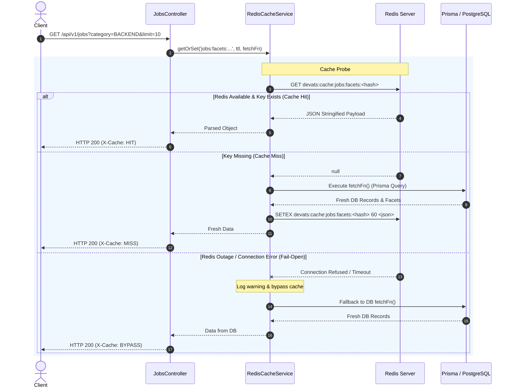

# SDD-0001: Redis Cache & Distributed Rate-Limiting Subsystem

- **Status**: IMPLEMENTED
- **Date**: 2026-08-21
- **Author**: Gabriel & Antigravity Agent
- **Associated ADR**: [ADR-0001: Redis Caching & Distributed Rate-Limiting Architecture](../adr/0001-redis-caching-and-distributed-rate-limiting.md)
- **Target Components**: `backend/src/redis/`, `backend/src/jobs/`, `backend/src/ingestion/`, `docker-compose.yml`

---

## 1. Executive Summary & Goals

### 1.1 Problem Statement
The DevATS backend relies on PostgreSQL for complex faceted job filtering and runs outbound ATS discovery queries that require protection against traffic spikes and DoS attacks. We need a robust, fault-tolerant Redis caching and distributed rate-limiting subsystem integrated into the NestJS Fastify backend.

### 1.2 Goals (In-Scope)
- [x] Provision Redis 7 Alpine service in `docker-compose.yml` and backend configuration.
- [x] Implement a resilient `RedisModule` and `RedisCacheService` with automatic reconnects and **Fail-Open** graceful degradation.
- [x] Implement deterministic cache key generation using canonical (sorted) query parameters and SHA-256 hashing.
- [x] Apply Cache-Aside pattern to `GET /api/v1/jobs`, `GET /api/v1/jobs/:idOrSlug`, and `GET /api/v1/jobs/tags`.
- [x] Implement automatic cache invalidation on ATS sync and job ingestion mutations.
- [x] Implement distributed sliding-window rate limiting with custom tiered policies for search and ingestion endpoints.
- [x] Deliver comprehensive unit and integration test suites validating cache hits, misses, invalidation, and fail-open behavior.

### 1.3 Non-Goals (Out-of-Scope)
- ❌ Multi-region Redis cluster / Redis Sentinel setup (single-node Redis is sufficient for current scale).
- ❌ Caching WebSocket / SSE event streams (`/api/v1/ingest/discovery-stream` remains direct reactive RxJS streams).

---

## 2. System Architecture & Component Interaction

### 2.1 High-Level Component Diagram

```mermaid
graph TD
    Client["Client / Frontend"] -->|HTTP Request| FastifyGateway["Fastify Engine / NestJS App"]
    FastifyGateway --> RateLimitGuard["Distributed Rate Limiter Guard"]
    RateLimitGuard -->|Check / Increment Token| Redis[(Redis 7)]
    
    FastifyGateway --> JobsController["JobsController / IngestionController"]
    JobsController --> RedisCache["RedisCacheService (Cache-Aside)"]
    
    RedisCache -->|1. Cache Hit (< 3ms)| Redis
    RedisCache -->|2. Cache Miss / Degraded Mode| PrismaService["Prisma ORM"]
    PrismaService --> Postgres[(PostgreSQL 17)]
    
    IngestionService["IngestionService"] -->|Job Ingested / Mutated| InvalidationBus["Cache Invalidation Trigger"]
    InvalidationBus -->|DEL devats:cache:jobs:*| Redis
```

### 2.2 Sequence Diagram: Cache-Aside with Fail-Open Resilience



---

## 3. Detailed Technical Specifications

### 3.1 Redis Key Namespaces & TTL Policies

| Domain | Key Pattern | Type | TTL | Purpose | Invalidation Event |
|---|---|---|---|---|---|
| **Jobs Facets** | `devats:cache:jobs:facets:<sha256_hash>` | String (JSON) | `60s` | Faceted search results & counts | On ATS ingestion sync |
| **Job Details** | `devats:cache:jobs:detail:<idOrSlug>` | String (JSON) | `300s` | Single job view | On job update/sync |
| **Top Tags** | `devats:cache:jobs:tags:<limit>` | String (JSON) | `600s` | Technology tag cloud aggregation | On ATS ingestion sync |
| **Providers** | `devats:cache:ingest:providers` | String (JSON) | `3600s` | Static list of ATS providers | Manual / Restart |
| **Rate Limit** | `devats:ratelimit:<ip>:<route>` | Integer (Incr) | `60s` | Distributed request counter | Automatic TTL expiry |

### 3.2 Canonical Query Normalization Algorithm
To prevent cache fragmentation, query parameters are sorted alphabetically and normalized before hashing:
```typescript
export function generateCanonicalQueryKey(prefix: string, query: Record<string, any>): string {
  const sortedKeys = Object.keys(query).filter(k => query[k] !== undefined && query[k] !== '').sort();
  const normalizedParams = sortedKeys.map(k => `${k}=${encodeURIComponent(String(query[k]))}`).join('&');
  const hash = crypto.createHash('sha256').update(normalizedParams).digest('hex').substring(0, 16);
  return `${prefix}:${hash || 'default'}`;
}
```

### 3.3 Rate Limiting Policy Tiers

| Tier Name | Routes Target | Limit | Window | Action on Exceeded |
|---|---|---|---|---|
| `DEFAULT_API` | `GET /api/v1/*` | 120 requests | 60 seconds | `429 Too Many Requests` |
| `SEARCH_FACET` | `GET /api/v1/jobs` | 60 requests | 60 seconds | `429 Too Many Requests` |
| `INGEST_PROBE` | `POST /api/v1/ingest/discover*` | 10 requests | 60 seconds | `429 Too Many Requests` |
| `INGEST_SYNC` | `POST /api/v1/ingest/sync*` | 5 requests | 60 seconds | `429 Too Many Requests` |

### 3.4 Resilience & Fail-Open Contract
- Redis connections must use lazy connect with retry strategy (`maxRetriesPerRequest: 1`, reconnection backoff `min(times * 150, 2000)`).
- `RedisCacheService` methods must NEVER throw unhandled exceptions if Redis is down.
- All operations must fall through to the database `fetchFn()`.

---

## 4. Security & Threat Model

| Threat Vector | Risk Level | Mitigation Strategy |
|---|---|---|
| **Cache Poisoning** | Medium | Canonical parameter sanitization + strict DTO validation with `class-validator` before cache key generation. |
| **Upstream ATS DoS** | High | Distributed sliding-window rate limiting on `/api/v1/ingest/*` endpoints to prevent IP blacklisting. |
| **Redis Memory Exhaustion** | Medium | All keys have strict TTLs; configure Redis with `maxmemory 256mb` and `maxmemory-policy allkeys-lru`. |
| **Unauthenticated Redis Access** | Medium | Redis isolated within internal Docker bridge network (`jobs_network`), not exposed on public ports. |

---

## 5. Acceptance Criteria & Test Verification Matrix

- [x] **Docker Compose**: Redis 7 container runs healthy with persistent volume / memory limit.
- [x] **Unit Tests (`redis-cache.service.spec.ts`)**:
  - [x] Validates cache miss executes DB supplier and stores value in Redis with TTL.
  - [x] Validates cache hit returns stored JSON without invoking DB supplier.
  - [x] Validates wildcard invalidation (`invalidatePattern`) correctly scans and deletes matching keys.
  - [x] Validates fail-open behavior: when Redis client errors, data is returned from DB without throwing.
- [x] **Integration / Controller Tests (`jobs.controller.spec.ts`)**:
  - [x] `GET /api/v1/jobs` populates cache and returns cached payload on subsequent identical request.
  - [x] Ingest sync triggers cache clearing.
- [x] **Rate Limiting Tests (`redis-rate-limiter.guard.spec.ts`)**:
  - [x] Exceeding request threshold on `/api/v1/ingest/discover` returns HTTP 429.

