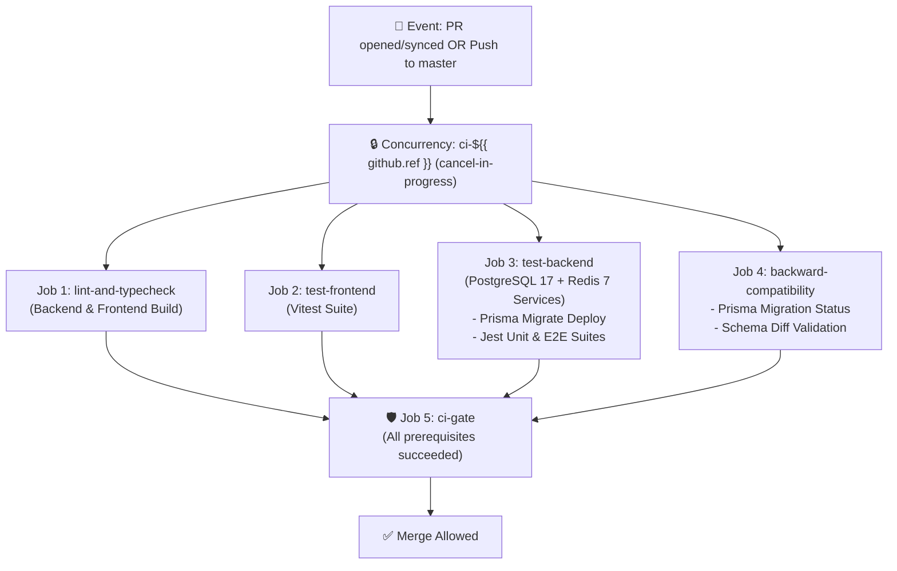

# SDD-0002: CI Pipeline & Backward-Compatibility Guardrails

- **Status**: IMPLEMENTED
- **Date**: 2026-08-21
- **Author**: Gabriel & Antigravity Agent
- **Associated ADR**: [ADR-0002: CI Pipeline and Backward-Compatibility Quality Gates](../adr/0002-ci-pipeline-and-backward-compatibility-quality-gates.md)
- **Target Components**: `.github/workflows/ci.yml`, `backend/`, `frontend/`, `Makefile`

---

## 1. Executive Summary & Goals

### 1.1 Problem Statement
We need an automated Continuous Integration pipeline in GitHub Actions that runs on every Pull Request creation, update (new push), and merge to `master`. The pipeline must validate static typing, execute all backend and frontend test suites, verify live Prisma migrations against Postgres 17 and Redis 7, and enforce backward compatibility guardrails.

### 1.2 Goals (In-Scope)
- [x] Configure `.github/workflows/ci.yml` with triggers for `pull_request` (`opened`, `synchronize`, `reopened`) and `push` to `master`.
- [x] Implement concurrency grouping to auto-cancel redundant in-flight runs on new commits.
- [x] Parallelize backend and frontend validation across dedicated runner jobs.
- [x] Run ephemeral `postgres:17-alpine` and `redis:7-alpine` service containers for live E2E and integration tests.
- [x] Enforce **Prisma Migration Backward Compatibility**:
  - Validates `prisma migrate status` (detects unapplied or drifted migrations).
  - Validates `prisma migrate diff` to ensure schema definitions match migration files.
- [x] Provide a single unified `ci-gate` job that acts as the required GitHub Branch Protection check.
- [x] Add a local single-command `make ci` target in `Makefile` to mirror the exact CI checks locally.

### 1.3 Non-Goals (Out-of-Scope)
- ❌ Automatic production deployment / CD pipeline (this SDD focuses exclusively on CI verification and quality gating).
- ❌ Performance load testing in CI runner (benchmarking should run in dedicated staging).

---

## 2. Pipeline Architecture & Job Dependency Graph

### 2.1 Job Flow Diagram



---

## 3. Detailed Technical Specifications

### 3.1 Workflow Trigger & Concurrency Configuration

```yaml
name: CI Quality Gate & Backward Compatibility

on:
  pull_request:
    branches: [master]
    types: [opened, synchronize, reopened]
  push:
    branches: [master]

concurrency:
  group: ci-${{ github.workflow }}-${{ github.ref }}
  cancel-in-progress: true
```

### 3.2 Job Breakdown & Execution Matrix

| Job Name | Runners / Environment | Services | Commands Executed |
|---|---|---|---|
| `lint-and-typecheck` | `ubuntu-latest`, Node.js 22 | None | `cd backend && npm run build`<br/>`cd frontend && npm run build` |
| `test-frontend` | `ubuntu-latest`, Node.js 22 | None | `cd frontend && npm test` |
| `test-backend` | `ubuntu-latest`, Node.js 22 | `postgres:17-alpine`<br/>`redis:7-alpine` | `cd backend && npx prisma migrate deploy`<br/>`cd backend && npm test`<br/>`cd backend && npm run test:e2e` |
| `backward-compatibility` | `ubuntu-latest`, Node.js 22 | `postgres:17-alpine` | `cd backend && npx prisma migrate status`<br/>`cd backend && npx prisma migrate diff --from-schema-datasource prisma/schema.prisma --to-schema-datamodel prisma/schema.prisma --exit-code` |
| `ci-gate` | `ubuntu-latest` | None | `needs: [lint-and-typecheck, test-frontend, test-backend, backward-compatibility]`<br/>Verifies all status checks passed |

### 3.3 Database Migration Backward-Compatibility Contract
The backward-compatibility job strictly verifies:
1. **Migration History Integrity**: `prisma migrate status` checks whether all migrations committed to the repository have been applied cleanly.
2. **Schema Drift Detection**: `prisma migrate diff --from-schema-datasource prisma/schema.prisma --to-schema-datamodel prisma/schema.prisma --exit-code` asserts that no developer modified `schema.prisma` without generating a corresponding migration file in `prisma/migrations/`.

---

## 4. Security & Threat Model

| Threat Vector | Risk Level | Mitigation Strategy |
|---|---|---|
| **Secret Exfiltration via PR from Fork** | High | The CI workflow relies solely on built-in `GITHUB_TOKEN` and local ephemeral containers; no external production credentials are exposed. |
| **Flaky Upstream Network Calls** | Medium | All tests run against local containerized PostgreSQL and Redis. Ingestion probers are tested with deterministic mocks. |
| **Breaking Database Schemas** | High | `prisma migrate status` and `diff` run on a fresh PostgreSQL instance before any code can merge. |

---

## 5. Acceptance Criteria & Test Verification Matrix

- [x] **GitHub Actions Workflow File**: `.github/workflows/ci.yml` created with all 5 jobs and correct trigger rules.
- [x] **Local Verification Target**: `make ci` added to `Makefile` executing the full pipeline locally.
- [x] **Typecheck & Build Validation**: Backend NestJS and Frontend Vite builds pass with exit code 0.
- [x] **Backend Unit & E2E Tests**: All Jest unit tests and Fastify E2E tests pass against live Postgres & Redis.
- [x] **Frontend Tests**: All 15 Vitest tests pass with exit code 0.
- [x] **Prisma Backward-Compatibility Verification**: Migration status and schema diff checks pass cleanly.

