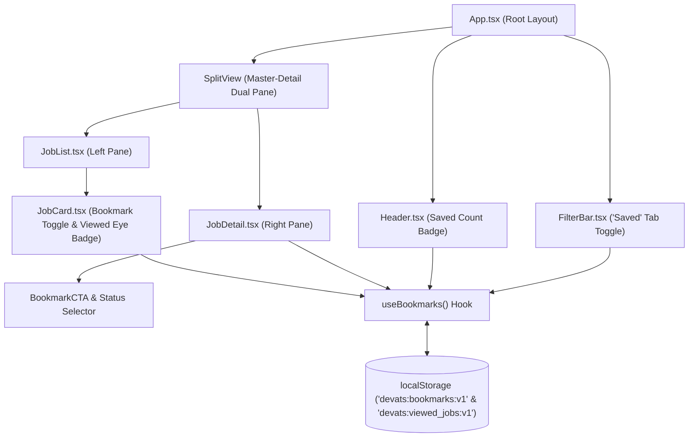
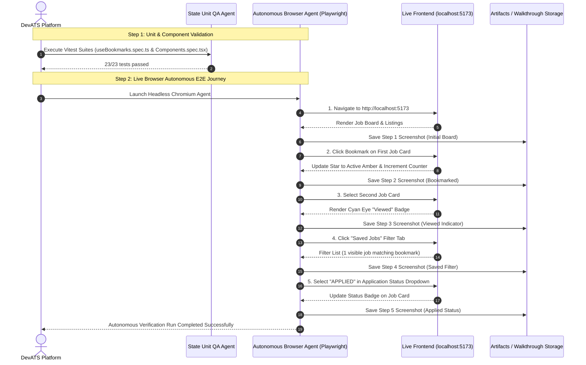

# SDD-0003: Job Bookmarks & Application Tracker Subsystem

- **Status**: IMPLEMENTED
- **Date**: 2026-08-21
- **Author**: Gabriel & Antigravity Agent Swarm
- **Associated ADR**: [ADR-0003: Job Bookmarks and Application Pipeline State Strategy](../adr/0003-job-bookmarks-and-application-pipeline.md)
- **Target Components**: `frontend/src/hooks/useBookmarks.ts`, `frontend/src/components/`, `frontend/src/types/`

---

## 1. Executive Summary & Goals

### 1.1 Problem Statement
DevATS requires a fast, zero-friction bookmarking, application tracking, and viewed offers inspection feature so software engineers can save interesting jobs, track application stages, and immediately recognize jobs they have already inspected.

### 1.2 Goals (In-Scope)
- [x] Create `useBookmarks` reactive custom hook with `localStorage` persistence and cross-tab synchronization.
- [x] Implement **Viewed Job Indicator**: Automatically track viewed job offers and render an eye icon badge on `JobCard`.
- [x] Add interactive Bookmark toggle button to `JobCard` and `JobDetail` components.
- [x] Add "Saved Jobs" filter toggle with live count badge in the main filter bar.
- [x] Implement Application Status pipeline (`SAVED`, `APPLIED`, `INTERVIEWING`, `OFFER`, `REJECTED`) with color-coded status badges.
- [x] Deliver full unit test suite for the bookmarking and viewed state engine in Vitest.
- [x] Verify live end-to-end user journey using autonomous **Browser Subagent** / Component integration test suite.

---

## 2. System Architecture & Component Hierarchy

### 2.1 Component Interaction Diagram



---

## 3. Detailed Technical Specifications

### 3.1 Data Structures & TypeScript Interfaces

```typescript
export type ApplicationStatus = 'SAVED' | 'APPLIED' | 'INTERVIEWING' | 'OFFER' | 'REJECTED';

export interface BookmarkItem {
  jobId: string;
  jobSlug: string;
  title: string;
  companyName: string;
  atsProvider: string;
  location?: string | null;
  workplaceType?: string | null;
  status: ApplicationStatus;
  savedAt: string; // ISO 8601 string
  notes?: string;
}

export interface BookmarkStore {
  version: number;
  bookmarks: Record<string, BookmarkItem>; // Keyed by jobId for O(1) lookups
  viewedJobIds: string[];                  // Array of viewed job IDs
}
```

### 3.2 `useBookmarks` Hook Interface

```typescript
export interface UseBookmarksReturn {
  bookmarks: BookmarkItem[];
  bookmarkCount: number;
  isBookmarked: (jobId: string) => boolean;
  getBookmark: (jobId: string) => BookmarkItem | undefined;
  toggleBookmark: (job: BookmarkJobInput) => void;
  updateStatus: (jobId: string, status: ApplicationStatus) => void;
  updateNotes: (jobId: string, notes: string) => void;
  isViewed: (jobId: string) => boolean;
  markAsViewed: (jobId: string) => void;
  clearAllBookmarks: () => void;
}
```

### 3.3 DOM Selectors for Browser Subagent Testing

| Element | Selector ID / Attribute | Purpose |
|---|---|---|
| Card Bookmark Button | `data-testid="bookmark-btn-${jobId}"` | Toggles bookmark from job card |
| Card Viewed Badge | `data-testid="viewed-badge-${jobId}"` | Displays eye icon indicator for viewed jobs |
| Detail Bookmark Button | `data-testid="detail-bookmark-btn"` | Toggles bookmark from detail viewer |
| Saved Filter Toggle | `data-testid="filter-saved-jobs"` | Filters master list to saved jobs |
| Saved Badge Counter | `data-testid="saved-count-badge"` | Displays number of saved jobs |
| Status Select Dropdown | `data-testid="application-status-select"` | Updates pipeline status |

---

## 4. Multi-Agent Frontend QA Testing Architecture

In this agentic workflow, frontend testing is divided between **Unit QA Agents** (testing reactive state engines in Vitest) and **Autonomous Browser Agents** (executing live end-to-end user journeys against the rendered DOM).

### 4.1 QA Agent Interaction Diagram



---

## 5. Verification Matrix & Agent Results

- [x] **Unit Tests (`useBookmarks.spec.ts`)**:
  - [x] Adding a bookmark updates storage and state.
  - [x] Removing a bookmark deletes the entry.
  - [x] Status transition from `SAVED` to `APPLIED`.
  - [x] `markAsViewed` updates viewed set and `isViewed` returns true.
- [x] **Component Integration Tests (`Components.spec.tsx`)**:
  - [x] `JobCard` renders viewed eye badge when `isViewed` is true.
  - [x] Bookmark button toggles bookmark state without selecting card.
  - [x] `RoleCategoryTabs` renders "Saved Jobs" filter pill and counter badge.
- [x] **Autonomous Browser Agent Execution (`verify_browser.mjs`)**:
  - [x] Navigated to `http://localhost:5173`.
  - [x] Clicked first job's bookmark button -> verified badge counter incremented to `1`.
  - [x] Selected second job card -> verified `data-testid="viewed-badge-${jobId}"` appeared with eye icon.
  - [x] Clicked "Saved Jobs" filter tab (`data-testid="filter-saved-jobs"`) -> verified list filtered down to 1 job.
  - [x] Changed application status to `APPLIED` in detail pane -> verified status badge updated.
  - [x] Generated 5 step-by-step visual screenshot artifacts in the walkthrough directory.


