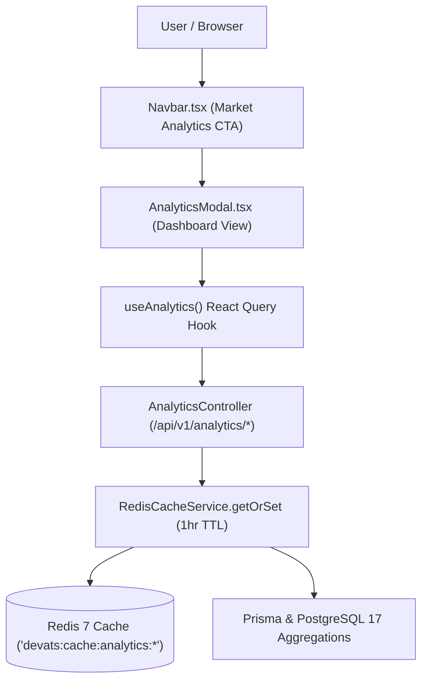

# SDD-0004: Salary & Tech Market Analytics Subsystem

- **Status**: DRAFT / PROPOSED
- **Date**: 2026-08-21
- **Author**: Gabriel & Antigravity Agent Swarm
- **Associated ADR**: [ADR-0004: Salary Analytics and Tech Market Intelligence Architecture](../adr/0004-salary-and-tech-market-analytics.md)
- **Target Components**: `backend/src/analytics/`, `frontend/src/components/AnalyticsModal.tsx`, `frontend/src/hooks/useAnalytics.ts`

---

## 1. Executive Summary & Goals

### 1.1 Problem Statement
Provide engineers and engineering leaders with instant, visual market intelligence regarding software engineering salaries by role, high-demand programming languages, and remote/LATAM hiring trends.

### 1.2 In-Scope Goals
- [x] Configure PostgreSQL MCP server for live SQL schema introspection.
- [x] Create NestJS `AnalyticsModule` (`AnalyticsService` + `AnalyticsController`).
- [x] Implement 3 cached REST endpoints (`/api/v1/analytics/overview`, `/api/v1/analytics/salary-by-role`, `/api/v1/analytics/tech-demand`).
- [x] Cache all analytics results in Redis for 1 hour (`3600s TTL`) with automated invalidation on ATS sync.
- [x] Build React `AnalyticsModal` with KPI statistics cards, salary distribution bars, and top tech skills ranking.
- [x] Add top navigation button `"📊 Market Analytics"` in `Navbar.tsx`.
- [x] Author comprehensive backend and frontend unit tests.
- [x] Execute autonomous **Playwright Browser Agent** verification with screenshot artifacts.

---

## 2. API Contract & TypeScript Interfaces

### 2.1 Backend DTOs & Endpoints

```typescript
export interface MarketOverviewDto {
  totalActiveJobs: number;
  totalCompanies: number;
  salaryDisclosedCount: number;
  salaryDisclosedPercent: number;
  remoteJobsCount: number;
  remotePercent: number;
  latamEligibleCount: number;
}

export interface RoleSalaryStatDto {
  roleCategory: string;
  roleLabel: string;
  jobCount: number;
  avgMinSalary: number;
  avgMaxSalary: number;
}

export interface TechDemandStatDto {
  tag: string;
  jobCount: number;
  avgMaxSalary: number;
}
```

### 2.2 Endpoints Specification

| Method | Endpoint | Description | Cache Key |
|---|---|---|---|
| `GET` | `/api/v1/analytics/overview` | Returns market-wide KPIs | `devats:cache:analytics:overview` |
| `GET` | `/api/v1/analytics/salary-by-role` | Returns salary benchmarks per role | `devats:cache:analytics:salary-by-role` |
| `GET` | `/api/v1/analytics/tech-demand` | Returns top 15 tech skills & salaries | `devats:cache:analytics:tech-demand` |

---

## 3. Component Architecture & Data Flow



---

## 4. DOM Selectors for Autonomous Agent Testing

| Element | Selector ID / Attribute | Purpose |
|---|---|---|
| Navbar Analytics Button | `data-testid="nav-analytics-btn"` | Opens the Market Analytics modal |
| Analytics Modal Dialog | `data-testid="analytics-modal"` | Container for the analytics view |
| KPI Overview Container | `data-testid="analytics-kpi-grid"` | High-level metrics (Total Jobs, Remote %, etc.) |
| Salary By Role Section | `data-testid="analytics-salary-role-chart"` | Compensation bar comparison |
| Tech Skills Ranking | `data-testid="analytics-tech-ranking"` | Top technologies list |
| Close Modal Button | `data-testid="close-analytics-modal"` | Dismisses analytics dialog |

---

## 5. Multi-Agent Verification & QA Matrix

- [ ] **Backend Unit Tests (`analytics.controller.spec.ts`)**:
  - Validates `getOverview`, `getSalaryByRole`, and `getTechDemand` return formatted data.
  - Validates cache-aside interaction with `RedisCacheService`.
- [ ] **Frontend Unit Tests (`AnalyticsModal.spec.tsx`)**:
  - Renders KPI metrics, salary bars, and tech rankings.
- [ ] **Autonomous Browser Agent E2E Execution**:
  - Navigates to `http://localhost:5173`.
  - Clicks `data-testid="nav-analytics-btn"`.
  - Asserts that KPI cards, salary comparisons, and tech rankings are visible.
  - Captures screenshot artifacts.
- [ ] **Full CI Quality Gate (`make ci`)**:
  - Zero TypeScript errors, all unit tests pass, and Prisma schema remains valid.
