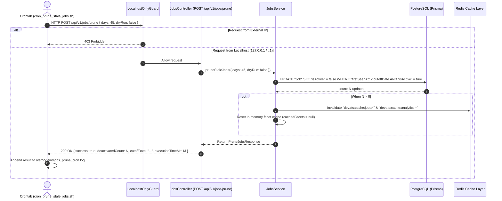

# SDD-0005: Stale Job Retention & Automated Pruning Subsystem

- **Status**: IMPLEMENTED
- **Date**: 2026-08-21
- **Author**: Gabriel & Antigravity Agent Swarm
- **Associated ADR**: [ADR-0005: Stale Job Retention, Soft-Deletion Lifecycle, and Automated Pruning Architecture](../adr/0005-stale-job-retention-and-automated-pruning.md)
- **Target Components**: `JobsService`, `JobsController`, `LocalhostOnlyGuard`, `cron_prune_stale_jobs.sh`

---

## 1. Executive Summary & Goals

### 1.1 Problem Statement
Jobs ingested by DevATS accumulate over time. When postings pass 45 days from their original discovery date, they must be marked inactive so that active search feeds (`/api/v1/jobs`) and facet tallies remain fresh and relevant, while preserving all underlying data for Market & Salary Analytics.

### 1.2 Goals (In-Scope)
- [x] **Soft-Deletion Lifecycle**: Automatically update `isActive = false` for all job records where `firstSeenAt < NOW() - 45 days` and `isActive = true`.
- [x] **Localhost VM Isolation**: Secure `POST /api/v1/jobs/prune` using `LocalhostOnlyGuard` so only local requests from `127.0.0.1`, `::1`, or `::ffff:127.0.0.1` are permitted. External requests receive `403 Forbidden`.
- [x] **Dry-Run Auditing**: Support `dryRun: true` mode to preview affected job counts without mutating records.
- [x] **Atomic Cache Eviction**: Purge Redis query caches (`devats:cache:jobs:*`, `devats:cache:analytics:*`) and clear in-memory facet caches upon state update.
- [x] **Standalone Cron Shell Script**: Provide `cron_prune_stale_jobs.sh` with exit code validation and audit logging.

### 1.3 Non-Goals (Out-of-Scope)
- ❌ Hard row deletion from PostgreSQL (rejected in favor of data preservation for analytics).
- ❌ Third-party ATS board webhooks for real-time removal (handled asynchronously via daily sync and pruning).

---

## 2. System Architecture & Component Interaction

### 2.1 High-Level Component Diagram & Sequence


---

## 3. Detailed Technical Specifications

### 3.1 Data Structures, DTOs & Contracts

#### PruneJobsDto
```typescript
export class PruneJobsDto {
  @IsOptional()
  @IsInt()
  @Min(1)
  @Max(365)
  days?: number = 45;

  @IsOptional()
  @IsBoolean()
  dryRun?: boolean = false;
}
```

#### PruneJobsResult
```typescript
export interface PruneJobsResult {
  success: boolean;
  message: string;
  deactivatedCount: number;
  cutoffDate: string;
  daysThreshold: number;
  dryRun: boolean;
  executionTimeMs: number;
}
```

### 3.2 Database Query Specification
```sql
-- Count matching stale jobs (Dry Run)
SELECT COUNT(*) 
FROM "Job" 
WHERE "firstSeenAt" < NOW() - INTERVAL '45 days' 
  AND "isActive" = true;

-- Soft-delete stale jobs
UPDATE "Job" 
SET "isActive" = false, "updatedAt" = NOW() 
WHERE "firstSeenAt" < NOW() - INTERVAL '45 days' 
  AND "isActive" = true;
```

### 3.3 Security & Threat Model

| Threat Vector | Risk Level | Mitigation in Design |
|---|---|---|
| Unauthorized Remote Execution | High | `LocalhostOnlyGuard` blocks any non-loopback IP (`req.ip !== '127.0.0.1'`, etc.) and inspects `x-forwarded-for` to reject proxied external traffic. |
| Denial of Service / Runaway Script | Medium | Endpoint guarded with `RedisRateLimiterGuard` (10 req / 60s). |
| Accidental Data Destruction | Low | Soft-delete only (`isActive = false`). Zero SQL `DELETE` calls. Dry-run mode for pre-flight verification. |

---

## 4. Acceptance Criteria & Test Verification Matrix

- [x] **Unit Tests**:
  - `LocalhostOnlyGuard` allows `127.0.0.1`, `::1`, `::ffff:127.0.0.1`.
  - `LocalhostOnlyGuard` throws `403 Forbidden` for public/external IPs (`203.0.113.1`, etc.).
  - `JobsService.pruneStaleJobs` computes correct 45-day cutoff timestamp.
  - `JobsService.pruneStaleJobs` in `dryRun` mode calls `count` without mutating records.
  - `JobsService.pruneStaleJobs` in live mode calls `updateMany({ data: { isActive: false } })` and triggers cache invalidation.
- [x] **Shell Automation**:
  - `cron_prune_stale_jobs.sh` executes with `0` exit code, logs timestamps and JSON responses.
