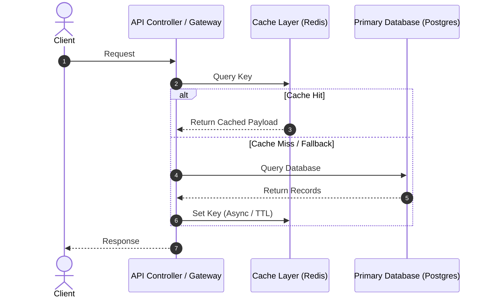

# SDD-XXXX: [System Design Document Title]

- **Status**: [DRAFT | REVIEW | APPROVED | IMPLEMENTED | OBSOLETE]
- **Date**: YYYY-MM-DD
- **Author**: [Name / AI Agent]
- **Associated ADR**: [Link to ADR-XXXX]
- **Target Components**: [e.g. Backend Ingestion, Jobs API, Redis Layer]

---

## 1. Executive Summary & Goals
### 1.1 Problem Statement
*Brief overview of the technical challenge or feature.*

### 1.2 Goals (In-Scope)
- [ ] Goal 1: Describe expected outcome.
- [ ] Goal 2: Performance or functional target.

### 1.3 Non-Goals (Out-of-Scope)
- ❌ Explicitly specify what will NOT be built in this iteration to prevent scope creep.

---

## 2. System Architecture & Component Interaction
### 2.1 High-Level Component Diagram
*Explain how the subsystem fits into the overall architecture.*

### 2.2 Sequence & Data Flow Diagram


---

## 3. Detailed Technical Specifications
### 3.1 Data Structures, Key Schemas & TTLs
*Define explicit namespaces, naming formats, serialization schemas, and expiration windows.*

| Namespace | Key Pattern | Type / Value Format | TTL | Purpose |
|---|---|---|---|---|
| `cache:domain:entity` | `ns:id` | JSON String / Hash | `60s` | Description |

### 3.2 Interfaces, DTOs & Contracts
*Exact TypeScript interfaces, NestJS DTOs, and error classes.*

```typescript
export interface IExampleService {
  get(key: string): Promise<string | null>;
  set(key: string, value: string, ttlSeconds: number): Promise<void>;
}
```

### 3.3 Error Handling & Fault Tolerance
- **Failure Mode Matrix**:
  - *Symptom / Exception*: Action taken (e.g. Fail-open, retry with backoff, circuit breaker).
  - *Degraded Mode*: How the system behaves when external dependencies fail.

---

## 4. Security & Threat Model
*Identify trust boundaries, input risks, and mitigation strategies.*

| Threat Vector (CWE) | Risk Level | Mitigation Strategy in Design |
|---|---|---|
| Injection / Poisoning | High | Strict key hashing & input sanitization |
| Denial of Service (DoS) | Medium | Rate limiting & bounded payload limits |

---

## 5. Acceptance Criteria & Test Verification Matrix
*Concrete checklist used to verify agent implementation.*

- [ ] **Unit Tests**:
  - Test case 1: Happy path validation.
  - Test case 2: Cache miss fallback to DB.
  - Test case 3: Redis disconnection resilience (fail-open).
- [ ] **Integration / E2E Tests**:
  - Test case 4: Rate limit threshold exceeded returns `429 Too Many Requests`.
- [ ] **Performance & Observability**:
  - Response time metric or benchmark validation.
